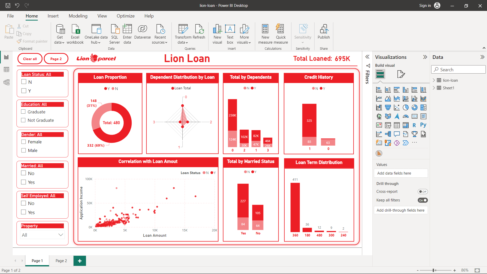
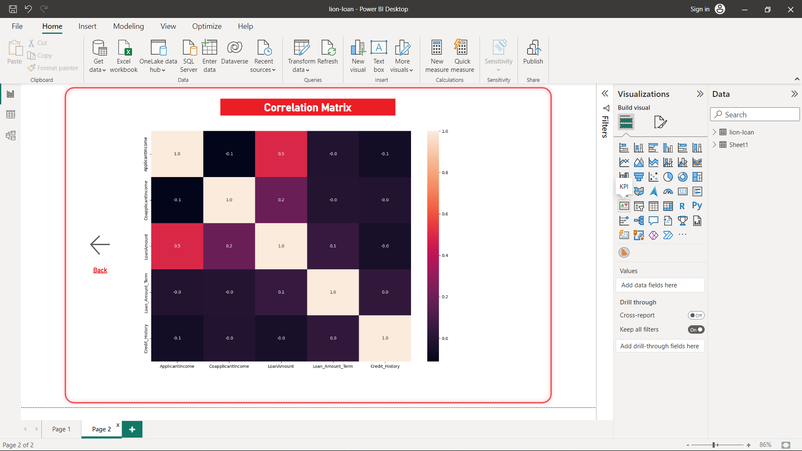

# About dashboard visualization

**Tools**: Power BI (non premium), Power Point

File `deck-presentation.pptx` merupakan power point digunakan untuk menjelaskan hasil analisa yang saya lakukan.

## Short Description

<<<<<<< HEAD
Dasbor visualisasi dibuat menggunakan software Power BI. Anda dapat melihat hasil visualisasi yang telah saya buat pada gambar berikut atau dapat men-download file Power BI tersebut yaitu `Customer-Profiling-Viz.pbix` agar dapat digunakan secara interaktif pada device anda. Berikut hasil dasbor visualisasi yang telah saya buat:

**Page 1**

**Page 1**

=======
Dasbor visualisasi dibuat menggunakan software Power BI. Anda dapat melihat hasil visualisasi yang telah saya buat pada gambar berikut atau dapat men-download file Power BI tersebut agar dapat digunakan secara interaktif pada device anda. Berikut hasil dasbor visualisasi yang telah saya buat:

>>>>>>> 6b6a83f5dbcc6745ba05e1e466f5fc92143063d5
